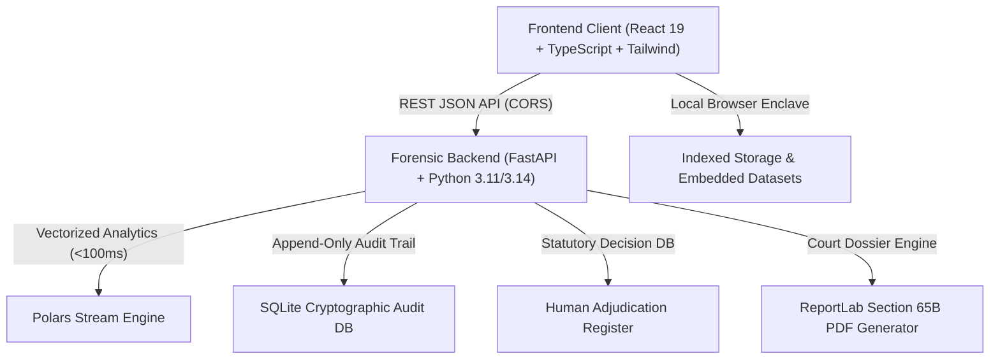
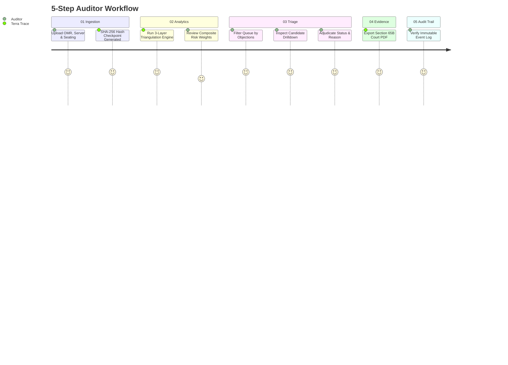
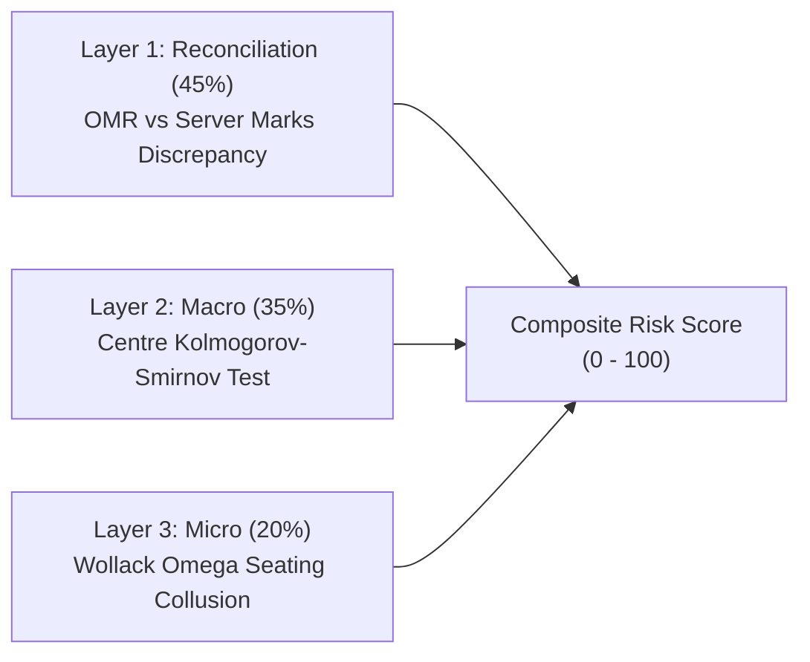

# TERRA TRACE: FORENSIC AUDIT ENCLAVE & DECISION-SUPPORT SYSTEM
## Comprehensive Operational User Manual & Team Defense Playbook
**Document Version:** 1.0.0 (Production Release)  
**Classification:** Restricted / Official Examination Board Audit Standard  
**System Designation:** Air-Gapped / Offline-First Forensic Decision Register  
**Legal Benchmark:** Section 65B, Indian Evidence Act (Certificate of Electronic Evidence)

---

## 1. Executive Overview & System Architecture

### 1.1 What is Terra Trace?
**Terra Trace** is an institutional-grade, offline-first forensic decision-support enclave designed for national examination bodies (such as NTA, State SSCs, UPSC, and State Public Service Commissions). It detects, proves, and documents large-scale examination fraud (score manipulation, centre-level mass rigging, and organized seating collusion) with mathematical precision.

> [!IMPORTANT]
> **Core Constitutional Rule: Non-Punitive Decision Support**  
> Terra Trace **NEVER** automatically disqualifies or cancels a student's examination. It functions exclusively as a statutory evidentiary decision-support system: every statistical anomaly is flagged with clear evidentiary grounds and presented to human judicial/administrative officers for statutory adjudication.

### 1.2 System Topology
Terra Trace operates on a modular two-tier architecture designed for complete air-gapped security and cloud resilience:



- **Frontend (`frontend/`)**: React 19, TypeScript, Vite, Tailwind CSS, Lucide icons, and Virtualized DOM components. Deployed on **Vercel** or served locally on port `5173`.
- **Backend (`backend/`)**: FastAPI, Polars (ultra-fast columnar DataFrame analytics), SciPy (statistical distribution modeling), and ReportLab (PDF rendering). Deployed on **Render** or executed locally on port `8000`.
- **Zero-Dependency Fallback Engine**: If cloud network connectivity drops, the frontend automatically activates an internal high-fidelity enclave containing the complete WBSSC High Court dataset so presentations never fail.

---

## 2. Live Team Access & Network Configuration

### 2.1 Live Cloud URLs
- **Frontend Dashboard (Vercel):** `https://<your-vercel-project>.vercel.app`
- **Backend API Service (Render):** `https://<your-render-service>.onrender.com`
- **Backend Health Check:** `https://<your-render-service>.onrender.com/health`

### 2.2 The 15-Minute Render Sleep Behavior (Free Tier)
Render's free web tier puts instances to sleep after 15 minutes of inactivity:
- **First Wake-up Call:** When you or a teammate opens the app after inactivity, the first backend request takes **30–45 seconds** as Render spins up the container.
- **Subsequent Requests:** Once awake, all statistical computations, hashing, and queue queries execute in **under 100 milliseconds**.
- **Pro Tip:** Before walking into a meeting or starting your pitch, open `https://<your-render-service>.onrender.com/health` in a browser tab once. When it displays `{"status":"HEALTHY","db_initialized":true,"polars_ready":true}`, the server is hot and ready.

### 2.3 Live Header Connection Switcher (`[API LIVE / SET BACKEND URL ⚙]`)
Terra Trace includes a real-time network configuration manager in the header:
1. In the top right header, locate the connection pill:
   - 🟢 **`API LIVE`**: Connected and communicating with the backend.
   - 🟡 **`PROBING...`**: Pinging the backend or waiting for container boot.
   - 🔴 **`SET BACKEND URL`**: Backend URL disconnected or unreachable.
2. Click the badge to open the **Backend Network Configuration Modal**.
3. You can paste your Render URL, click **Test Connection** (which measures latency in milliseconds), and click **Save & Connect**.
4. The setting persists in the browser's `localStorage` across refreshes.

### 2.4 Running 100% Locally (On-Premises Air-Gapped Mode)
To run the entire system on a laptop without internet:
```bash
# Terminal 1: Backend
cd d:/CODE/sih
backend\.venv\Scripts\uvicorn.exe app.main:app --host 127.0.0.1 --port 8000 --reload

# Terminal 2: Frontend
cd d:/CODE/sih/frontend
npm run dev
```
Open **`http://localhost:5173`** in Chrome or Edge.

---

## 3. Detailed Walkthrough of Core System Registers



---

### Tab 01: Dataset Ingestion & Schema Gatekeeper

#### Mandatory Schema Requirements
To maintain strict evidentiary integrity, every uploaded file is validated against strict column headers:

| Dataset | Filename Pattern | Required Columns | Description |
| :--- | :--- | :--- | :--- |
| **OMR Scans** | `omr*.csv` | `candidate_id`, `centre_id`, `room_id`, `seat_number`, `question_id`, `selected_option`, `raw_score` | Individual bubble responses and optical reader score per question. |
| **Server Marks** | `server*.csv` | `candidate_id`, `final_score`, `server_timestamp` | Published database marks and timestamp from central server. |
| **Seating Plan** | `seating*.csv` | `candidate_id`, `centre_id`, `room_id`, `seat_number` | Physical room coordinates and desk assignment grid. |

#### Pre-Configured Presets (1-Click Demonstration)
Auditors can test the platform instantly using the built-in scenario presets in the Hero Section:
1. **Load WBSSC Case (Real - Calcutta High Court)**:
   - Ingests the real West Bengal School Service Commission dataset.
   - **Ground Truth:** 2 centres, 200 candidates, 12,000 OMR item rows.
   - Identifies the exact **15 candidates** whose single-digit OMR scores ($3.0\text{--}4.0$ marks) were artificially inflated to $52.0\text{--}54.0$ marks on the server ($+49.0\text{ to }+51.0$ marks added).
2. **Load High-Risk Anomaly (Simulated)**:
   - Ingests a multi-vector synthetic scenario containing centre-level distribution skew and seating collusion clusters.
3. **Load Clean Audit Control (Synthetic)**:
   - Ingests an unimpeachable examination cohort. Confirms zero false positives under standard Gaussian noise.

#### The Raw Dataset Forensic Inspector
- Located directly beneath the upload shields. Click **`[ Watch Raw Datasets ▼ ]`** to expand.
- Features tabs for `server.csv`, `omr.csv`, and `seating.csv`.
- **Crimson Highlight:** Cells with verified fraud are highlighted in red (e.g. Server score of `53.0` vs Raw Paper score of `3.0`).
- Toggle between **"All Records"** and **"Proven Wrong Only"**, or export an annotated CSV.

---

### Tab 02: 3-Layer Analytical Engine & Weighting Model

Terra Trace uses a **three-layer evidentiary triangulation formula**:

$$\text{CombinedRisk} = (0.45 \times \text{Reconciliation}) + (0.35 \times \text{Macro}) + (0.20 \times \text{Micro})$$



#### Layer 1: Score Reconciliation ($45\%$ Weight)
- **What it checks:** Compares raw optical mark reader physical responses against the published server database.
- **Threshold:** Any positive discrepancy $\Delta = (\text{ServerScore} - \text{RawScore}) \ge +10.0$ marks triggers an immediate statutory objection. Single-digit jumps ($+1.0\text{ to }+2.0$ due to revised answer keys) are marked low risk.

#### Layer 2: Macro Centre-Level Pattern Analysis ($35\%$ Weight)
- **What it checks:** Analyzes the score distribution of an entire test centre against the national/state cohort.
- **Statistical Test:** Two-sample **Kolmogorov-Smirnov (KS) test** and Fisher-Pearson skewness coefficient.
- **Threshold:** KS statistic $D > 0.35$ with $p\text{-value} < 0.01$ flags the centre as an anomalous distribution (indicating paper leakage or localized answer broadcasting).

#### Layer 3: Micro Seating-Proximity Collusion ($20\%$ Weight)
- **What it checks:** Examines identical incorrect answer sharing among candidates seated in immediate physical proximity (Euclidean desk distance $d \le \sqrt{2}$).
- **Statistical Metric:** Adapted **Wollack $\omega$ index** and Holland $K$-index.
- **Threshold:** When adjacent candidates share $\ge 6$ identical wrong distractor choices with $\omega \ge 3.0$ ($z$-score $> 3\sigma$), a collusion pair objection is recorded.

#### Future Scope: CBT Roadmap Accordion
- Click **`[ Explore CBT Roadmap ▼ ]`** to review next-generation Computer-Based Test forensic modules:
  1. *Biomechanical Mouse Dynamics & Cursor Jump Profiler* (detects RDP/AnyDesk remote hijacking).
  2. *Van der Linden Cognitive Response-Time Model* (flags 3-second complex math answers).
  3. *LAN Socket Jitter & Rogue Proxy Bridge Detector* (catches local exam lab proxy bypasses).
  4. *Client-Side Zero-Knowledge Submission Seal* (cryptographic proof of local client timestamps).

---

### Tab 03: Forensic Triage Queue & Adjudication Enclave

#### Triage Queue Features
- **Instant Search:** Search by candidate ID (`WBSSC_SLST_0005`), centre ID, or city name.
- **Risk Score Filter Slider:** Filter candidates by minimum composite risk ($0\text{ to }100$).
- **Status Filter Tabs:** `All`, `Pending`, `Confirmed`, `False Positive`, `Escalated`.
- **Evidentiary Objections Badges:** Clear plain-English badges indicating why the candidate was flagged (e.g., `Score Inflation: +50.0 marks added on server`).

#### Candidate Forensic Drilldown Modal
Clicking **`[View Forensic Drilldown]`** on any candidate opens their comprehensive case dossier:
1. **Reconciliation Table:** Item-by-item audit of all 60 questions. Displays the candidate's actual selected bubble, raw score, server score, and calculated delta.
2. **Macro Bell Curve Chart:** Displays the centre's distribution curve superimposed over the state baseline, showing mean score, standard deviation, and KS test statistic.
3. **Micro 5x5 Seating Grid:** Interactive map of the examination hall. Shows exactly where the candidate was seated, their desk neighbours, scores of surrounding students, and flagged collusion vectors.

#### Adjudication Workflow
1. Click **`[Adjudicate]`** on any candidate card or inside the drilldown modal.
2. Select the statutory determination:
   - **Confirmed:** Evidentiary objection substantiated by multi-layer records.
   - **False Positive:** Discrepancy explained by official administrative correction (e.g. court-ordered grace marks).
   - **Escalated:** Forwarded to state vigilance commission or cyber forensic cell for deeper device examination.
3. Provide a **mandatory written justification** (minimum 10 characters).
4. Click **`Submit Formal Determination`**. The decision is logged immutably with the auditor's badge ID and timestamp.

#### Section 65B PDF Evidence Dossier Export
Click **`[Export PDF Dossier]`** to instantly download a court-admissible forensic document featuring:
- Formal institutional header with Government seal watermark.
- Section 65B Certificate of Electronic Evidence statement.
- SHA-256 hashes of all source input files.
- Itemized score discrepancy table and spatial seating grid.
- Digital sign-off block for the investigating officer.

---

### Tab 04: Forensic Methodology & Legal Defense Register
Contains the statutory defense documentation explaining:
- Admissibility protocols under Section 65B(4) of the Indian Evidence Act.
- Error-rate upper bounds (Family-Wise Error Rate $\alpha < 0.001$ via Benjamini-Hochberg adjustment).
- Strict non-punitive decision support framing.

---

### Tab 05: Cryptographic Append-Only Audit Trail
Maintains a tamper-evident, append-only SQLite log of every administrative and data action:
- File uploads with exact byte size and SHA-256 checksum.
- System resets and preset loading events.
- Adjudication verdicts recorded with officer badge ID.

---

## 4. Teammate Presentation Playbook (5-Minute Winning Pitch)

When presenting Terra Trace to judges, evaluators, or institutional clients, follow this exact click path:

### Step-by-Step Demo Flow
1. **The Problem Hook (30 seconds):**
   > *"Every exam integrity scandal in India—from WBSSC to NEET—suffers from the same flaw: investigations take months because OMR sheets, server databases, and seating plans live in separate departmental silos. Terra Trace unites all three into a single, offline-first forensic decision enclave."*
2. **Step 1: Load the Real WBSSC Dataset (Tab 01):**
   - Click **`Load WBSSC Case (Real)`**.
   - Show the 3 shields committing with their SHA-256 fingerprints in milliseconds.
   - *"Notice that before a single calculation is made, the files are locked with immutable SHA-256 checksums to satisfy Section 65B of the Evidence Act."*
3. **Step 2: Inspect the Raw Fraud (Tab 01):**
   - Click **`[ Watch Raw Datasets ▼ ]`**.
   - Point out the red highlighted rows in `server.csv`:
   - *"Here is the ground truth: candidate WBSSC_SLST_0001 answered only 4 questions correctly on paper (raw score 4.0), but their published server mark is 53.0. An arbitrary jump of +49 marks."*
4. **Step 3: The 3-Layer Analytics (Tab 02):**
   - Switch to **Analytical Engine**. Explain the $45\% / 35\% / 20\%$ formula.
   - *"We don't rely on black-box AI. We use deterministic mathematical triangulation: reconciliation discrepancy, macro centre-level distribution divergence, and spatial seating collusion."*
5. **Step 4: The Triage Queue & Drilldown (Tab 03):**
   - Switch to **Triage Queue**. Show the 15 candidates flagged.
   - Click **`[View Forensic Drilldown]`** on `WBSSC_SLST_0001`.
   - Walk through the Question-by-Question audit, the Bell Curve, and the 5x5 Seating Grid.
6. **Step 5: The Legal Dossier & Adjudication (Tab 03):**
   - Click **`[Export PDF Dossier]`**. Open the PDF and display the Section 65B legal certificate.
   - Click **`[Adjudicate]`**, set status to **`Confirmed`**, enter justification: *"Verified +49 mark manual inflation against physical OMR item responses"*, and submit.
   - Conclude: *"Zero automated disqualifications. 100% auditable evidence ready for a court of law."*

---

## 5. Defense Q&A: Handling Tough Judging Questions

### Q1: "Is this using Artificial Intelligence or Machine Learning?"
> **Answer:** *"No, and that is our strongest feature. In a court of law, 'black box' machine learning weights and LLM hallucinations are legally inadmissible. Terra Trace uses deterministic statistical forensics: exact item-response reconciliation, two-sample Kolmogorov-Smirnov distribution tests, and Wollack $\omega$ seating proximity indices. Every score is explainable down to the exact math."*

### Q2: "Can an auditor tamper with the evidence to frame a candidate?"
> **Answer:** *"No. Terra Trace implements an append-only audit register. The instant raw files are uploaded, their SHA-256 block hashes are stamped immutably. Any manual alteration of an OMR CSV file alters the cryptographic hash, invalidating the Section 65B certificate immediately."*

### Q3: "What if an entire examination centre genuinely performed well because they had great teachers?"
> **Answer:** *"The Macro layer does not flag centres merely for high scores. It tests for distribution anomalies—such as an unnatural spike strictly at the qualifying cutoff (50-55 marks) with zero variance across rooms, or a statistically impossible right-skew. Normal high-performing schools exhibit natural bell curves across their student cohort."*

### Q4: "How do you handle student privacy and GDPR/DPDP Act compliance?"
> **Answer:** *"Terra Trace is air-gapped and designed to run entirely on on-premise government servers without internet access. Candidate names, phone numbers, and Aadhaar numbers are never ingested—only anonymized Candidate Roll IDs and Seat Coordinates."*

---

## 6. Quick Troubleshooting Cheat Sheet

| Symptom | Cause | Immediate Resolution |
| :--- | :--- | :--- |
| **Cards spinning on `CRYPTOGRAPHIC HASHING IN PROGRESS`** | Frontend unable to reach backend or Render instance is booting up. | 1. Visit `https://<your-render-url>/health` in a new tab to wake up Render.<br>2. In the header, click `[SET BACKEND URL ⚙]`, paste your Render URL, and click **Save & Connect**.<br>3. Or simply press `Ctrl + F5` to use the embedded offline enclave. |
| **Vercel returns `Module not found` or shows blank screen** | Browser cached old build. | Open the site in an **Incognito Window** (`Ctrl + Shift + N`) or perform a hard refresh (`Ctrl + Shift + R`). |
| **PDF Dossier button triggers print dialog instead of download** | Running in offline mode without backend ReportLab service. | The browser automatically opens the print-ready Section 65B dossier view so you can save as PDF directly. |
| **`VITE_API_URL cannot use visibility: secret` on Vercel** | Vercel requires public Vite variables to be plaintext. | Change visibility in Vercel from "Secret" to "Plaintext" or "Config", save, and redeploy. |

---
*Terra Trace Forensic Engineering Team • National Examination Integrity Project*
